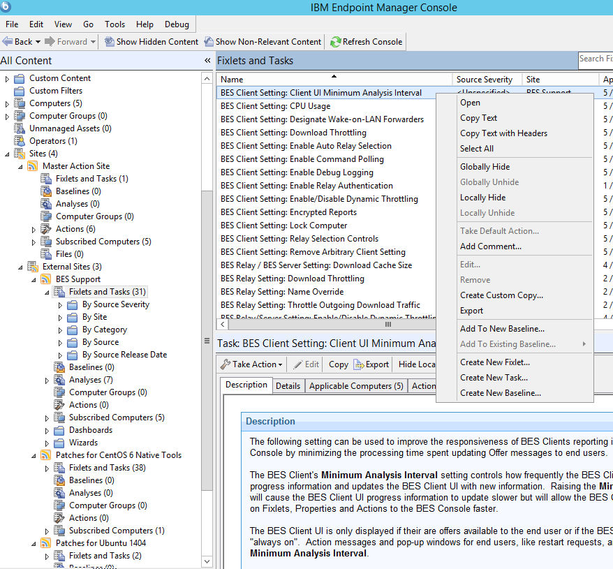

Equivalent Action in Console
---
Select a Site to add the fixlet to -> click "Fixlets and Tasks" -> Right-click any fixlet and select "Create New Fixlet..."

Explanation of [`fixlet.xml`](https://github.com/bigfix/restapi-examples/blob/master/create-fixlet/cURL/fixlet.xml)
---
* Title - (Permissible Values: any string) The name of the Fixlet
* Description - (Permissible Values: any string) A user-defined description of what the Fixlet does; can contain HTML content
* Relevance - One or more *Relevance* tags, or a single *GroupRelevance* tag
  * Relevance - (Permissible Values: any relevance expression that evaluates to true or false) A relevance statement that evaluates to true for computers that this Fixlet should run on. All Relevance tags must evaluate to `true` in order for the Fixlet to run.
  * GroupRelevance - Same as relevance but for Computer Groups that this Fixlet should run on.
* Category - (Optional, defaults to `""`) (Permissible Values: any string) User-defined groupings (for example, "Licensing", "Update", "Support")
* DownloadSize - (Optional, defaults to `0`) (Permissible Values: any non-negative integer) The size of the download that this Fixlet will run.
* Source - (Optional, defaults to `""`) (Permissible Values: any string) The organization or company that produced this Fixlet
* SourceID - (Optional, defaults to `""`) (Permissible Values: any string) The ID of that organization or company
* SourceReleaseDate - (Optional, defaults to `""`) (Permissible Values: any valid date in the format `yyyy-mm-dd`) The date this Fixlet was released
* SourceSeverity - (Optional, defaults to `""`) (Permissible Values: any string) How important this Fixlet is (Critical, Moderate, etc.)
* DefaultAction - (Optional; if omitted then no default action set) The Action to take by default (bolded in the "Take Action" menu)
  * _Attribute "ID"_ - (Permissible Values: any string) The name of this action. In the console, this is automatically be set to something like `Action1`.
  * Description - (Optional, defaults to `""`) The text that appears in the Actions box of the Description tab of a Fixlet. Clicking on the link will initiate the "Take Action" dialog box
    * PreLink - (Permissible Values: any string) The text that comes before the link
    * Link - (Permissible Values: any string) The text that will be a link
    * PostLink - (Permissible Values: any string) The text after the link
  * ActionScript - (Permissible Values: any ActionScript)
    * _Attribute "MIMEType"_ - (Optional, defaults to BigFix ActionScript)
* Action - (Optional, Repeatable; if omitted then no default action set) An Action that this Fixlet can take. Any number of these tags can appear; each will create a separate Action.
  * _Attribute "ID"_ - (Permissible Values: any string) The name of this action. In the console, this is automatically be set to something like `Action1`.
  * Description - (Optional, defaults to `""`) The text that appears in the Actions box of the Description tab of a Fixlet. Clicking on the link will initiate the "Take Action" dialog box
    * PreLink - (Permissible Values: any string) The text that comes before the link
    * Link - (Permissible Values: any string) The text that will be a link
    * PostLink - (Permissible Values: any string) The text after the link
  * ActionScript - (Permissible Values: any ActionScript)
    * _Attribute "MIMEType"_ - (Optional, defaults to BigFix ActionScript)
 
Usage
---
This command will POST the [`fixlet.xml`](https://github.com/bigfix/restapi-examples/blob/master/create-fixlet/cURL/fixlet.xml) file to the server, creating a fixlet
from the operator source `bigfix` with severity `critical` to shut down all
clients with an outdated version.

    curl -X POST --data-binary @fixlet.xml --user username:password https://server:port/api/fixlets/operator/bigfix

See [cURL overview](../../README.md#cURL) for more information on using cURL.