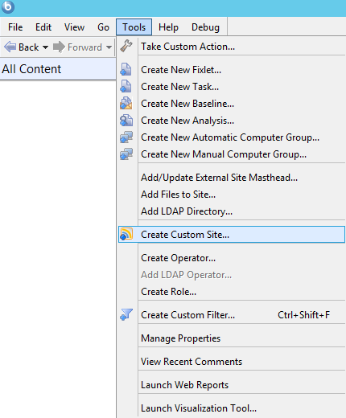
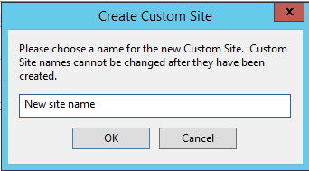

Equivalent Action in Console
===

Click on the Main Menu -> Tools -> Create Custom Site.

Explanation of [`site.xml`](site.xml)
====

Starts with the `CustomSite` tag.

* Name - (Permissible Values: any string) Name of new Site
* Description - (Optional, defaults to empty string) (Permissible Values: any string) Description about new Site
* Domain - (Optional) (Permissible Values: any 4 alphanumeric characters)
* GlobalReadPermission - (Optional) (Permissible Values: true, false)
* Subscriptions - (Optional)
  * Mode - (Permissible Values: All, None, AdHoc, Custom)
  * CustomGroup - (Optional)
    * Attribute JoinByIntersection - (Permissible Values: true, false)
    * SearchComponentRelevance
      * Attribute Comparison - (Permissible Values: IsTrue, IsFalse)
      * Relevance - (Permissible Values: any relevance expression)
* SiteRelevance - (Optional) (Permissible Values: any string)

Usage
---

This command will POST the file [`site.xml`](site.xml) to the server to create the new CustomSite contained in `site.xml`.

    curl -X POST --data-binary @site.xml --user username:password https://server:port/api/sites

See [cURL overview](../../README.md#cURL) for more information on using [cURL](http://curl.haxx.se/).
