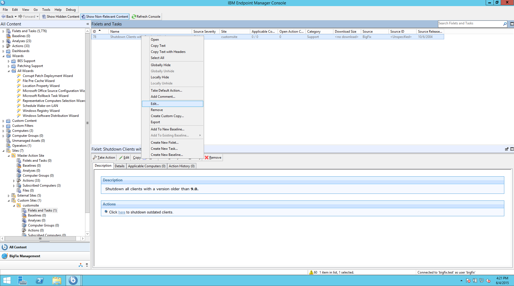
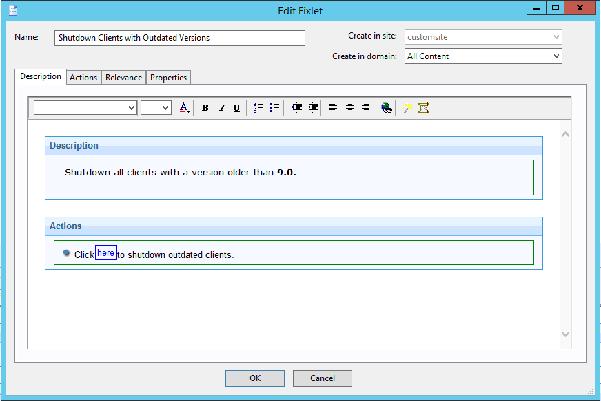
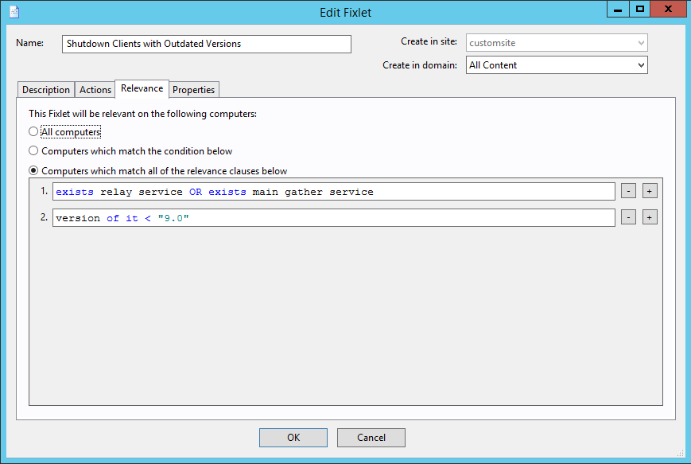
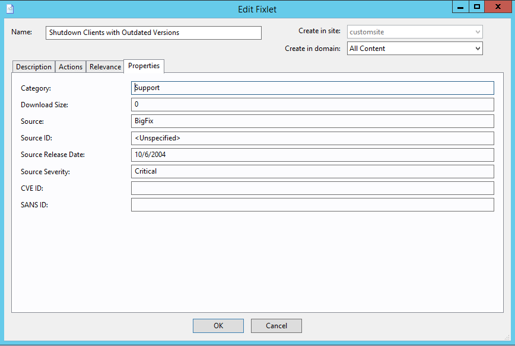
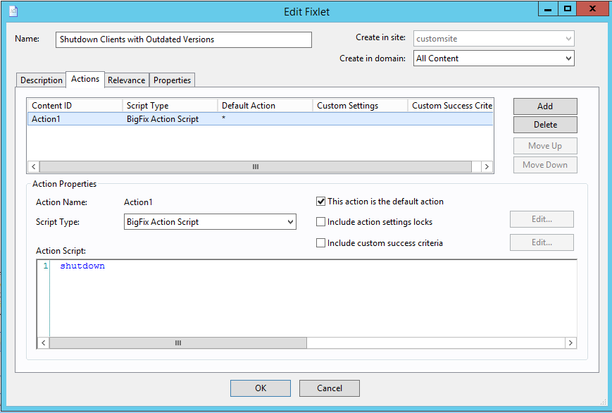

Equivalent Action in Console
===
Right-click a Fixlet and select "Edit".

Explanation of [`fixlet.xml`](fixlet.xml)
===
* Title - (Permissible Values: any string) The name of the Fixlet
* Description - (Permissible Values: any string) A user-defined description of what the Fixlet does; can contain HTML content (if HTML is used, should be contained in a `<![CDATA[ ... ]]>` block.

This screenshot shows the fixlet's title, description, and lists the descriptions of its actions.

* One or more *Relevance* tags, or a single *GroupRelevance* tag
  * Relevance - (Permissible Values: any relevance expression that evaluates to true or false) A relevance statement that evaluates to true when executed against computers that this Fixlet should run on. All Relevance tags must evaluate to `true` in order for the Fixlet to run.
  * GroupRelevance - Same as relevance but for Computer Groups that this Fixlet should run on.

This screenshot shows where the contents of the `Relevance` tags go.

* Category - (Optional, defaults to `""`) (Permissible Values: any string) User-defined groupings (for example, "Licensing", "Update", "Computer Support")
* DownloadSize - (Optional, defaults to `0`) (Permissible Values: any non-negative integer) The size of the download that this Fixlet will run.
* Source - (Optional, defaults to `""`) (Permissible Values: any string) The organization or company that produced this Fixlet
* SourceID - (Optional, defaults to `""`) (Permissible Values: any string) The ID of that organization or company
* SourceReleaseDate - (Optional, defaults to `""`) (Permissible Values: any valid date in the format `yyyy-mm-dd`) The date this Fixlet was released
* SourceSeverity - (Optional, defaults to `""`) (Permissible Values: any string) How important this Fixlet is (Critical, Moderate, etc.)
* CVENames - (Optional, defaults to `""`) (Permissible Values: any string) The CVE (Common Vulnerabilities and Exposures) ID that this Fixlet addresses, if any
* SANSID - (Optional, defaults to `""`) (Permissible Values: any string) The SANS ID that this Fixlet addresses, if any.
* MimeField  - (Optional)
  * Name - (Permissible values: any string)
  * Value - (Permissible values: any string)
* Domain - (Optional) (Permissible Values: Exactly 4 basic Latin characters)
* Delay - (Optional) (Permissible Values: strings matching the regular expression `P([0-9]+D)?(T([0-9]+H)?([0-9]+M)?([0-9]+(\.[0-9]{1,6})?S)?)?`)

This screenshot shows other properties that the fixlet can have.

* DefaultAction - (Optional; if omitted then no default action set) The Action to take by default (select the "This action is the default action" checkbox; bolded in the "Take Action" menu)
  * _Attribute "ID"_ - (Permissible Values: any string) The name of this action. In the console, this is automatically be set to something like `Action1`.
  * Description - (Optional, defaults to `""`) The text that appears in the Actions box of the Description tab of a Fixlet. Clicking on the link will initiate the "Take Action" dialog box
    * PreLink - (Permissible Values: any string) The text that comes before the link
    * Link - (Permissible Values: any string) The text that will be a link
    * PostLink - (Permissible Values: any string) The text after the link
  * ActionScript - (Permissible Values: any ActionScript)
    * _Attribute "MIMEType"_ - (Optional, defaults to BigFix ActionScript)
* Action - (Optional, Repeatable; if omitted then no default action set) An Action that this Fixlet can take. Any number of these tags can appear; each will create a separate Action.
  * _Attribute "ID"_ - (Permissible Values: any string) The name of this action. In the console, this is automatically be set to something like `Action1`.
  * Description - (Optional, defaults to `""`) The text that appears in the Actions box of the Description tab of a Fixlet. Clicking on the link will initiate the "Take Action" dialog box
    * PreLink - (Permissible Values: any string) The text that comes before the link
    * Link - (Permissible Values: any string) The text that will be a link
    * PostLink - (Permissible Values: any string) The text after the link
  * ActionScript - (Permissible Values: any ActionScript)
    * _Attribute "MIMEType"_ - (Optional, defaults to BigFix ActionScript)

This screenshot shows the actions in this fixlet (there is only one, in this case). Notice that the `This action is the default action` button is checked; this is because the action was declared in a `DefaultAction` tag, rather than an `Action` tag. The `MIMEType` attribute of the `ActionScript` tag determines the script type.

Usage
---

This command will PUT the `fixlet.xml` file onto the server, updating a fixlet
on the master action site whose fixlet ID is `37`.

    curl -X PUT --data-binary @fixlet.xml --user username:password https://server:port/api/fixlet/master/37

See [cURL overview](../../README.md#cURL) for more information on using cURL.
